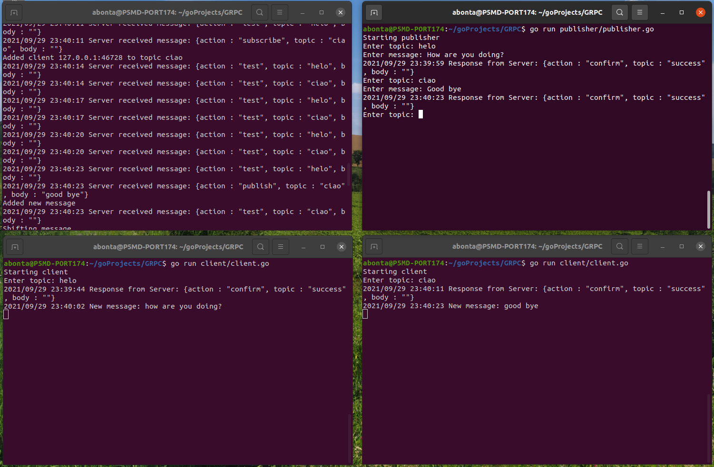

### go pubsub message broker using gRCP

# Getting started

1) install go https://golang.org/doc/install

2) verify go `go version`

3) install external libraries: 
* `go get google.golang.org/grpc`
* `go get golang.org/x/net/context`
* `go get google.golang.org/grpc/peer`

5) run the broker `go run broker/broker.go` or using [run] button in your IDE

6) run the subscriber `go run client/client.go` or using [run] button in your IDE

7) run the publisher `go run publisher/publisher.go` or using [run] button in your IDE

8) write the topic in subscriber's console

10) write the topic and message in publisher's console

## Demo

